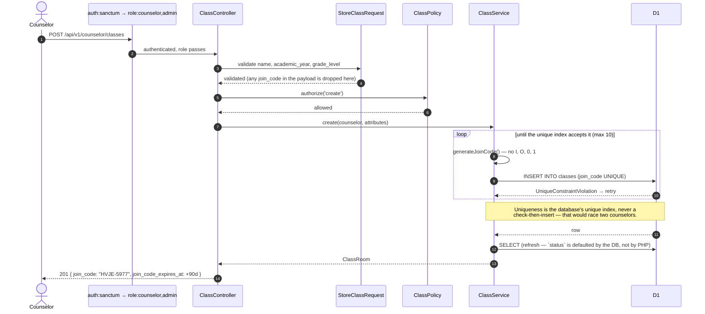
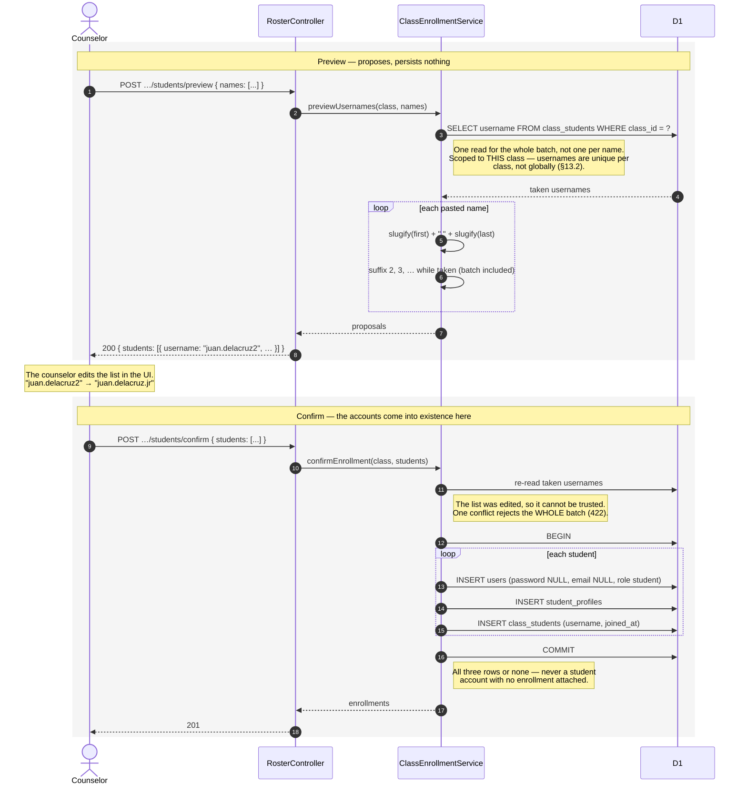

# Sequence Diagrams — Phase 1: Class & Enrollment

The three flows built in Phases 1A–1C, drawn as they were implemented on the pre-v1.3 Laravel
backend. Layering follows the §17 request lifecycle as it then read: **Route → middleware → thin
Controller → Form Request → Service → Eloquent.** No repository layer, no action classes, no DTOs
for internal calls.

> **v1.3 note:** the *sequence* of responsibilities in these diagrams is what the Phase 3.5
> Worker port must preserve; the layer names map one-to-one to the v1.3 stack (Controller → Hono
> route handler, Form Request → Zod schema, Eloquent → Drizzle, Sanctum token → `api_tokens`
> bearer token — FULLPLAN §17, §38).

---

## 1. Class creation — the join code exists before the roster does

The code is issued at creation, not when the first student is added (§13.2, §57). It is never
accepted as input: `join_code` is deliberately absent from `ClassRoom::$fillable`, so
`ClassService` writes it with `forceFill` and a client cannot choose its own.



---

## 2. Roster provisioning — paste, preview, edit, confirm

Two requests, deliberately. **No student ever self-registers**; the counselor is the only path by
which a student account comes into existence.



---

## 3. Student access — passwordless, and the whole security model in one diagram

The class code is the entire secret. Every branch below that ends in a rejection returns the
**same** 401 with the **same** message — while writing the real reason to `audit_logs`.

```mermaid
sequenceDiagram
    autonumber
    actor S as Student
    participant Ctl as StudentAccessController
    participant Svc as StudentAccessService
    participant RL as RateLimiter
    participant Aud as AuditService
    participant DB as D1

    S->>Ctl: POST /api/v1/student-access/join { class_code, username }
    Note over S,Ctl: No token. No password field. Not an optional one.
    Ctl->>Svc: join(code, username, ip)

    Svc->>RL: tooManyAttempts(sha1(code|ip), 10)
    alt frozen
        RL-->>Svc: yes
        Svc->>Aud: STUDENT_CLASS_ACCESS_THROTTLED
        Svc-->>S: 429 — even if the credentials are correct
    end

    Svc->>DB: SELECT * FROM classes WHERE join_code = ?

    alt no such code / expired / not active
        Svc->>RL: hit(key, 900s)
        Svc->>Aud: FAILED, reason = INVALID_CODE | CODE_EXPIRED | CLASS_NOT_ACTIVE
        Svc-->>S: 401 "The class code or username is incorrect."
    end

    Svc->>DB: SELECT * FROM class_students WHERE class_id = ? AND username = ?

    alt unknown username / removed / account inactive
        Svc->>RL: hit(key, 900s)
        Svc->>Aud: FAILED, reason = UNKNOWN_USERNAME | ENROLLMENT_REMOVED | ACCOUNT_INACTIVE
        Svc-->>S: 401 "The class code or username is incorrect."
    end

    Note over Svc,S: Identical response for all six. A wrong code and a<br/>wrong username are indistinguishable — which is what<br/>stops this endpoint enumerating the roster (§38).

    Svc->>RL: clear(key)
    Note right of RL: Failures are counted; traffic is not.<br/>A whole class behind one school IP must not<br/>lock itself out by joining successfully.
    Svc->>DB: UPDATE users SET last_login_at
    Svc->>DB: DELETE existing tokens (one active session)
    Svc->>DB: INSERT personal_access_tokens
    Svc->>Aud: STUDENT_CLASS_ACCESS_SUCCESS (user, class, ip)
    Svc-->>Ctl: { user, class, enrollment, token }
    Ctl-->>S: 200 { token } — no join_code echoed back
```

### What the token means

The issued token is an ordinary Sanctum bearer token, indistinguishable downstream from a staff
one. Passwordless changes **how an identity is claimed**, not what it can see once claimed: every
Policy check behind it runs exactly as it would for any other user (§38). A student's token
authenticating against a counselor endpoint gets a `403`, not a `401` — it is authenticated, and
then refused.
